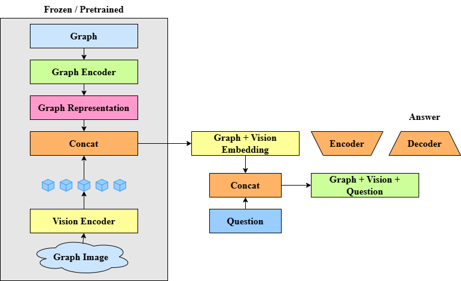

# KRAKEN 


KRAKEN is an advanced Natural Language Processing (NLP) system designed to process and analyze graph-structured data with natural language interactions. The project implements a sophisticated pipeline combining graph encoding, visual transformers, and question-answering capabilities.




## 🌟 Features

- Graph-to-text generation using advanced transformer models
- Visual graph encoding with state-of-the-art sentence transformers
- Question-answering system for graph-structured data
- Support for WebNLG dataset processing and analysis
- Comprehensive evaluation metrics and logging

## 📁 Project Structure

```
├── Dataset/                      # Dataset files and statistics
│   ├── webnlg/                  # WebNLG graph datasets
│   └── *.json, *.csv            # Various dataset files and statistics
├── docs/                        # Project documentation
├── images/                      # Project images and diagrams
├── logs/                        # Training and inference logs
└── scripts/
    ├── dataset/                 # Dataset processing scripts
    └── model/                   # Model implementation
        ├── graph_vision_natural_text/
        ├── withoutQformer/      # Implementation without QFormer
        └── withQformer/         # Implementation with QFormer
```

## 🚀 Getting Started

### Prerequisites

- Python 3.8+
- PyTorch
- Sentence Transformers
- NetworkX (for graph processing)

### Installation

1. Clone the repository:
```bash
git clone https://github.com/shubhamZXCV/KRAKEN.git
cd KRAKEN
```

2. Set up a Python virtual environment:
```bash
python -m venv venv
source venv/bin/activate  # On Windows, use: venv\Scripts\activate
```

3. Install dependencies:
```bash
pip install -r requirements.txt
```

## 💻 Usage

### Data Preparation

1. Process the WebNLG dataset:
```bash
python scripts/dataset/render_webnlg.py
```

2. Generate QA pairs:
```bash
python scripts/dataset/generate_qa_pairs.py
```

### Training

To train the model with QFormer:
```bash
python scripts/model/withQformer/train.py
```

To train without QFormer:
```bash
python scripts/model/withoutQformer/finetune.py
```

### Inference

Run inference on test data:
```bash
python scripts/model/withQformer/inference.py
```

## 📊 Results


The system demonstrates strong performance on graph-based question answering tasks, with detailed results available in the `logs/` directory.

## 📚 Documentation

Detailed documentation about the project components, architecture, and methodologies can be found in the `docs/` directory.

## 🤝 Contributing

Contributions are welcome! Please feel free to submit a Pull Request.

## 📄 License

This project is licensed under the MIT License - see the LICENSE file for details.

## 👥 Authors

- @shubhamZXCV - Project Lead

## 📬 Contact

For questions and feedback, please open an issue in the GitHub repository.

---

*Note: This project is part of Advanced Natural Language Processing research.*